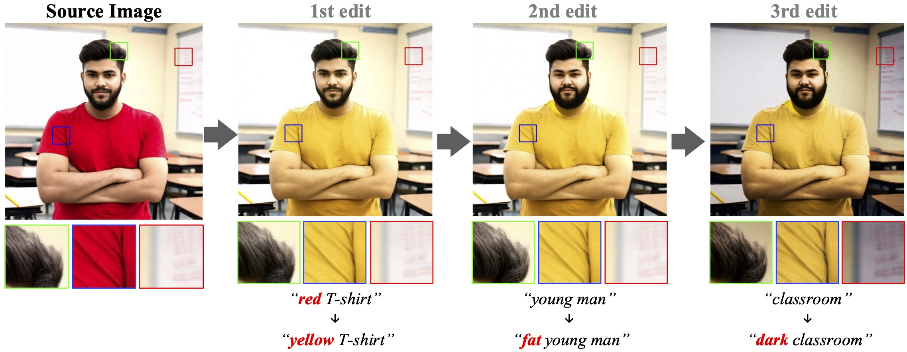

# ConsistEdit: Highly Consistent and Precise Training-free Visual Editing
[Zixin Yin](http://zxyin.github.io)<sup>1</sup>, [Ling-Hao Chen](https://lhchen.top/)<sup>2,3</sup>, [Lionel Ni]()<sup>1,4</sup>, [Xili Dai](https://delay-xili.github.io)<sup>4</sup>

<sup>1</sup>HKUST, <sup>2</sup>Tsinghua University, <sup>3</sup>IDEA Research, <sup>4</sup>HKUST(GZ)

<p align="center">
  <strong>✨ACM SIGGRAPH Asia 2025✨</strong>
</p>

<a href='https://arxiv.org/abs/2510.17803'></a>
<a href='https://zxyin.github.io/ConsistEdit'></a>

## 🎯 Demo



| Source Video | Edited Video |
|:------------:|:------------:|
|  |  |

## 🔧 Setup

### Requirements
```bash
pip install -r requirements.txt
```

### Model Preparation
Download the required diffusion models:
- **Stable Diffusion 3**: `/path/to/stable-diffusion-3-medium-diffusers`
- **FLUX.1-dev**: `/path/to/FLUX.1-dev`
- **CogVideoX-2b**: `/path/to/CogVideoX-2b`

Update the model paths in the scripts accordingly.

## 🚀 Quick Start

### Using Scripts

We provide two demonstration scripts in the `script/` directory:

#### 1. Consistent Editing (Change Color/Material)
```bash
bash script/sd3_consist_edit.sh
```

#### 2. Inconsistent Editing (Change Style/Object)
```bash
bash script/sd3_inconsist_edit.sh
```

### Manual Usage

#### Stable Diffusion 3
```bash
python run_synthesis_sd3.py \
    --src_prompt "a portrait of a woman in a red dress in a forest, best quality" \
    --tgt_prompt "a portrait of a woman in a yellow dress in a forest, best quality" \
    --edit_object "dress" \
    --out_dir "output" \
    --alpha 1.0 \
    --model_path "/path/to/stable-diffusion-3-medium-diffusers"
```
```bash
python run_synthesis_sd3.py \
    --src_prompt "a portrait of a woman in a red dress, realistic style, best quality" \
    --tgt_prompt "a portrait of a woman in a yellow dress, cartoon style, best quality" \
    --edit_object "dress" \
    --out_dir "output" \
    --alpha 0.3 \
    --model_path "/path/to/stable-diffusion-3-medium-diffusers"
```


#### FLUX
```bash
python run_synthesis_flux.py \
    --src_prompt "a portrait of a woman in a red dress in a forest, best quality" \
    --tgt_prompt "a portrait of a woman in a yellow dress in a forest, best quality" \
    --edit_object "dress" \
    --out_dir "output" \
    --alpha 1.0 \
    --model_path "/path/to/FLUX.1-dev"
```

#### CogVideo
```bash
python run_synthesis_cog.py \
    --src_prompt "a portrait of a woman in a red dress in a forest, best quality" \
    --tgt_prompt "a portrait of a woman in a yellow dress in a forest, best quality" \
    --edit_object "dress" \
    --out_dir "output" \
    --alpha 1.0 \
    --model_path "/path/to/CogVideoX-2b"
```

#### Real Image Editing
```bash
python run_real_sd3.py \
    --src_prompt "a girl with a red hat and red t-shirt is sitting in a park, best quality" \
    --tgt_prompt "a girl with a yellow hat and red t-shirt is sitting in a park, best quality" \
    --edit_object "hat" \
    --source_image_path "assets/red_hat_girl.png" \
    --out_dir "output" \
    --alpha 0.1 \
    --model_path "/path/to/stable-diffusion-3-medium-diffusers"
```

## 🎭 Masking Strategies

### Three Approaches Explained

#### 1. No Mask (`--no_mask`)
**What it does**: Disables masking and content fusion entirely.

**Result**: Colors in non-editing regions may change uncontrollably.

```bash
python run_synthesis_sd3.py --no_mask --alpha 0.3 ...
```

#### 2. Old Mask Method (`--use_old_mask`)
**What it does**: Original paper implementation with computational efficiency but inconsistency.

**Technical Details**:
- **Mask Calculation**: Uses vanilla attention computation
- **Image Generation**: Uses scaled dot-product attention computation

**Result**: ⚠️ Non-editing regions are suboptimal due to attention mismatch

#### 3. New Mask Method (Default, `use_old_mask=False`)
**What it does**: Our improved method with computational consistency

**Technical Details**:
- **Both Mask & Generation**: Use vanilla attention computation

**Result**: ✅ Optimal background preservation with perfect computational alignment

**Default (recommended)**: New mask method is used automatically.

## ⚙️ Parameters

### Common Parameters

| Parameter | Type | Default | Description |
|-----------|------|---------|-------------|
| `--src_prompt` | str | **Required** | **Source image prompt**: Text description used to generate the source image. This defines the initial state before editing. |
| `--tgt_prompt` | str | **Required** | **Target image prompt**: Text description for the edited result. |
| `--edit_object` | str | **Required** | **Edit object word**: Single word or phrase that appears in `src_prompt` and specifies what object to edit. Used for mask generation. |
| `--out_dir` | str | `"output"` | **Output directory**: Directory where generated images and masks will be saved. |
| `--alpha` | float | `1.0` | **Consistency strength**: Controls the strength of cross-attention injection (consistency_strength in paper). Range: 0.0-1.0. |
| `--model_path` | str | **Required** | **Model path**: Local path to the diffusion model directory. |
| `--no_mask` | flag | `False` | **Disable masking**: When set, no mask is generated and no content fusion is applied. Use this to observe uncontrolled changes. |
| `--use_old_mask` | flag | `False` | **Use paper method**: Enables the original paper's masking approach. Uses scale dot-product attention for generation (less accurate). |

### Model-Specific Parameters

#### Real Image Editing (`run_real_sd3.py`)
| Parameter | Type | Default | Description |
|-----------|------|---------|-------------|
| `--source_image_path` | str | `"assets/red_hat_girl.png"` | Input image path |

## 📊 Evaluation

### PIE-Bench Evaluation
To generate results for [PIE-Bench](https://github.com/cure-lab/PnPInversion) evaluation:

```bash
python run_metric.py \
    --model_path "/path/to/stable-diffusion-3-medium-diffusers" \
    --data_path "/path/to/pie-bench-dataset"
```

This script processes the PIE-Bench dataset and generates edited images for quantitative evaluation.

### Metric Calculation
To compute evaluation metrics:

```bash
python evaluate_sd3.py
```

## 📁 Project Structure

```
ConsistEdit_Code/
├── run_synthesis_sd3.py      # SD3 synthesis editing
├── run_synthesis_flux.py     # FLUX synthesis editing
├── run_synthesis_cog.py      # CogVideo editing
├── run_real_sd3.py          # Real image editing
├── run_metric.py            # PIE-Bench evaluation script
├── evaluate_sd3.py          # Metric calculation script
├── demo_sd3_masking.ipynb   # Interactive demonstration
├── script/
│   ├── sd3_consist_edit.sh   # Consistent editing demo
│   └── sd3_inconsist_edit.sh # Inconsistent editing demo
├── consistEdit/
│   ├── attention_control.py  # Cross-attention mechanisms
│   ├── solver.py            # Diffusion solvers
│   ├── utils.py             # Utility functions
│   └── global_var.py        # Global variables
├── evaluation/
│   └── matric_calculator.py  # Evaluation metrics
└── assets/                   # Sample images
```

## 🙏 Acknowledgments

This codebase is built upon and inspired by several excellent open-source projects:

- **[MasaCtrl](https://github.com/TencentARC/MasaCtrl)**: Tuning-Free Mutual Self-Attention Control for Consistent Image Synthesis and Editing
- **[PnPInversion](https://github.com/cure-lab/PnPInversion)**: Plug-and-Play diffusion features for text-driven image-to-image translation
- **[UniEdit-Flow](https://github.com/DSL-Lab/UniEdit-Flow)**: UniEdit-Flow: Unleashing Inversion and Editing in the Era of Flow Models
- **[DiTCtrl](https://github.com/TencentARC/DiTCtrl)**: DiTCtrl: Exploring Attention Control in Multi-Modal Diffusion Transformer for Tuning-Free Multi-Prompt Longer Video Generation

We thank the authors of these works for their valuable contributions to the diffusion model editing community.

## 📖 Citation

If you find this work useful, please cite our paper:

```bibtex
@inproceedings{yin2025consistedit,
  title={ConsistEdit: Highly Consistent and Precise Training-free Visual Editing},
  author={Yin, Zixin and Chen, Ling-Hao and Ni, Lionel and Dai, Xili},
  booktitle={SIGGRAPH Asia 2025 Conference Papers},
  year={2025},
  publisher={ACM},
  doi={10.1145/3757377.3763909},
  address={Hong Kong, China},
  isbn={979-8-4007-2137-3/2025/12}
}
```
